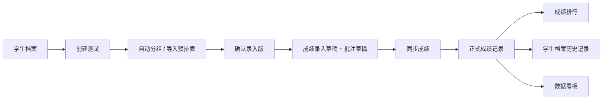

# 项目功能逻辑与数据逻辑梳理

更新时间：2026-05-01

线上地址：[https://ijijeas0n.github.io/tixun-management-system/](https://ijijeas0n.github.io/tixun-management-system/)

本文档整理当前项目已经实现的功能逻辑、操作路径、数据来源、数据流转关系，以及与《基础核心板块(1).docx》需求表之间的差异。重点细化所有和数据有关的板块。

---

## 1. 项目整体结构

当前系统是一个本地优先的体训管理系统，主要数据保存在浏览器本地。页面上看到的成绩排行、学生档案、数据看板，都不是单独维护一份数据，而是从“正式测试成绩记录”计算出来。

| 层级 | 说明 |
|---|---|
| 年度 | 左侧切换学年，例如 2025 学年 |
| 学生档案 | 每个学年下的学生名单 |
| 测试 | 一次测试包含名称、日期、请假学生、四个项目分组 |
| 分组版本 | 每次测试的每个项目都可以有多个分组版本 |
| 录入版 | 被确认用于成绩录入的分组版本 |
| 成绩草稿 | 成绩录入页里未同步前的临时输入 |
| 正式成绩 | 点击同步后写入学生名下的正式测试记录 |
| 分析结果 | 排行、看板、档案中的统计结果，全部由正式成绩计算 |

---

## 2. 页面入口逻辑

系统顶部有 4 个主要入口。

| 页面 | 作用 | 核心数据来源 |
|---|---|---|
| 成绩排行 | 查看某次测试的总分排行和单项排行，也可以导出报表 | 正式成绩记录 |
| 测试分组 | 创建测试、自动分组、导入预排表、确认录入版 | 学生档案、测试分组版本 |
| 成绩录入 | 按确认后的分组录入成绩和技术批注 | 录入版分组、成绩草稿、批注草稿 |
| 学生档案 | 管理学生、查看个人历史成绩和技术批注 | 学生档案、正式成绩记录 |

左侧是学年切换。切换学年后，页面只显示该学年下的学生、测试和成绩。

---

## 3. 浏览器本地保存的数据

当前项目没有接入服务器数据库，主要数据保存在浏览器 localStorage 中。换电脑、换浏览器、清空浏览器数据后，数据不会自动同步。

| 保存键 | 保存内容 | 作用 |
|---|---|---|
| `fujian_sports_app_data` | 项目主数据 | 保存学年、学生、测试、正式成绩 |
| `fujian_sports_app_data_year` | 当前选中的学年 | 下次打开时恢复当前学年 |
| `testing_group_entry_drafts` | 成绩录入草稿 | 未同步的成绩输入，不切页丢失 |
| `testing_group_entry_comments` | 技术批注草稿 | 未同步的学生项目批注 |
| `testing_group_score_sync_history` | 成绩同步撤销记录 | 支持撤销最近同步过的成绩 |
| `testing_group_entry_version_selections` | 录入页临时选择的版本 | 切换栏目回来后保持正在看的版本 |
| `testing_group_voice_api_settings` | 腾讯云语音配置 | 当前浏览器保存语音识别配置 |

---

## 4. 主数据结构

主数据保存在 `fujian_sports_app_data` 里，整体结构可以理解为：

| 字段 | 含义 |
|---|---|
| `years` | 所有学年 |
| `students` | 所有学生档案 |
| `records` | 所有正式成绩记录，按学生 ID 分组 |
| `testSessions` | 所有测试和测试分组 |

### 4.1 学年数据

| 字段 | 含义 |
|---|---|
| `id` | 学年唯一 ID |
| `name` | 学年名称，例如 `2025` |

学年用于隔离学生、测试和展示范围。

### 4.2 学生数据

| 字段 | 含义 | 当前状态 |
|---|---|---|
| `id` | 学生唯一 ID | 已有 |
| `studentNo` | 学号/编号 | 已有 |
| `name` | 姓名 | 已有 |
| `gender` | 性别，男/女 | 已有 |
| `yearId` | 所属学年 | 已有 |
| 头像 | 学生头像 | 暂无真实头像上传，只显示姓名首字 |
| 身高 | 身高 | 暂无 |
| 体重 | 体重 | 暂无 |
| BMI | 体重指数 | 暂无 |

学生档案是分组、成绩录入、排名和看板的人员基础。

### 4.3 测试数据

一次测试保存为 `testSession`。

| 字段 | 含义 |
|---|---|
| `id` | 测试唯一 ID |
| `name` | 测试名称 |
| `date` | 测试日期 |
| `yearId` | 所属学年 |
| `absentStudentIds` | 本次请假学生 |
| `activeVersionIds` | 每个项目当前正在查看/编辑的分组版本 |
| `entryVersionIds` | 每个项目被确认用于成绩录入的分组版本 |
| `groupingVersions` | 四个项目的全部分组版本 |
| `trialConfigs` | 四个项目各自有几次成绩记录框 |
| `groupScheduleConfigs` | 分组时间设置，例如首组时间和组间隔 |

### 4.4 分组版本数据

每次测试的每个项目都可以有多个分组版本。

| 字段 | 含义 |
|---|---|
| `id` | 分组版本 ID |
| `name` | 版本名称，例如版本 1 |
| `event` | 项目：100米、铅球、三级跳、800米 |
| `createdAt` | 创建时间 |
| `source` | 来源：自动生成或导入 |
| `mode` | 分组模式：按人数或按组数 |
| `groupSize` | 每组人数 |
| `groupCount` | 总组数 |
| `groups` | 该版本下的全部组 |

### 4.5 单个分组数据

| 字段 | 含义 |
|---|---|
| `id` | 分组 ID |
| `name` | 组名，例如男生第1组 |
| `marker` | 分组备注 |
| `startTime` | 该组开始时间 |
| `gender` | 男组、女组或混合组 |
| `members` | 组内学生 |

### 4.6 组内学生数据

| 字段 | 含义 |
|---|---|
| `studentId` | 学生 ID |
| `lane` | 道次，主要用于 100 米 |
| `order` | 位次/顺序，主要用于铅球、三级跳、800 米 |
| `rank` | 导入表里带来的排名信息 |
| `note` | 导入表里带来的个人备注 |

### 4.7 正式成绩记录

正式成绩记录保存在 `records` 中，结构是：

`学生 ID -> 该学生的多次测试记录`

单条正式成绩记录：

| 字段 | 含义 |
|---|---|
| `id` | 成绩记录 ID |
| `date` | 测试日期 |
| `testSessionId` | 关联的测试 ID |
| `testName` | 测试名称 |
| `scores` | 四项成绩和多次成绩记录 |
| `points` | 四项得分和总分 |
| `comments` | 四项技术批注 |

### 4.8 成绩数据

`scores` 里保存最终成绩和多次成绩。

| 字段 | 含义 |
|---|---|
| `hundred` | 100 米最终成绩 |
| `hundredAttempts` | 100 米多次记录 |
| `shotPut` | 铅球最终成绩 |
| `shotPutAttempts` | 铅球多次记录 |
| `tripleJump` | 三级跳最终成绩 |
| `tripleJumpAttempts` | 三级跳多次记录 |
| `eightHundred` | 800 米最终成绩 |
| `eightHundredAttempts` | 800 米多次记录 |

最终成绩规则：

| 项目 | 最终成绩取值 |
|---|---|
| 100 米 | 多次记录中用时最短的一次 |
| 800 米 | 多次记录中用时最短的一次 |
| 铅球 | 多次记录中距离最远的一次 |
| 三级跳 | 多次记录中距离最远的一次 |

800 米可以输入 `2:12` 这种格式，系统内部会换算成秒保存。

### 4.9 得分数据

`points` 保存四项得分和总分。

| 字段 | 含义 |
|---|---|
| `hundred` | 100 米得分 |
| `shotPut` | 铅球得分 |
| `tripleJump` | 三级跳得分 |
| `eightHundred` | 800 米得分 |
| `total` | 四项总分 |

当前每个项目满分 25 分，总分满分 100 分。得分会根据学生性别使用不同评分表。

### 4.10 技术批注数据

技术批注保存在正式成绩记录的 `comments` 中。

| 字段 | 含义 |
|---|---|
| `comments.hundred` | 100 米批注 |
| `comments.shotPut` | 铅球批注 |
| `comments.tripleJump` | 三级跳批注 |
| `comments.eightHundred` | 800 米批注 |

批注是跟着“学生 + 测试 + 项目”保存的，不是单独挂在学生基础档案上。这样可以追溯某次测试某个项目的技术表现。

---

## 5. 核心数据流转

### 5.1 总流程

### 5.2 详细路径

| 步骤 | 操作 | 写入位置 | 后续被谁读取 |
|---|---|---|---|
| 1 | 手动新增或导入学生 | `students` | 分组、档案、排行、看板 |
| 2 | 新建测试 | `testSessions` | 分组页、录入页、排行筛选 |
| 3 | 选择请假学生 | `testSession.absentStudentIds` | 自动分组时排除 |
| 4 | 自动生成分组 | `testSession.groupingVersions` | 分组页、录入页 |
| 5 | 导入预排表 | `students` 和 `testSessions` | 分组页、录入页 |
| 6 | 确认分组 | `testSession.entryVersionIds` | 成绩录入页 |
| 7 | 输入成绩 | `testing_group_entry_drafts` | 录入页恢复草稿 |
| 8 | 输入批注 | `testing_group_entry_comments` | 录入页恢复批注草稿 |
| 9 | 同步本组/所有组 | `records` | 排行、档案、看板 |
| 10 | 系统算分 | `record.points` | 排行、档案、看板 |
| 11 | 撤销同步 | `records` 回滚到旧值 | 排行、档案、看板重新计算 |

---

## 6. 成绩录入的数据逻辑

成绩录入页不是直接改正式成绩，而是先写草稿。

### 6.1 草稿保存规则

成绩草稿的保存键由三部分组成：

`测试 ID + 项目 + 分组版本 ID`

这意味着：

| 情况 | 结果 |
|---|---|
| 切换到别的栏目 | 草稿保留 |
| 切换项目 | 只显示该项目的草稿 |
| 切换测试 | 只显示该测试的草稿 |
| 切换分组版本 | 显示该版本自己的草稿 |
| 确认同步 | 草稿仍可保留，但正式数据已更新 |

### 6.2 同步规则

点击“同步本组成绩”或“同步所有组”时：

1. 系统读取当前测试、当前项目、当前录入版。
2. 读取该版本下每个学生的草稿成绩。
3. 按项目规则选出最佳成绩。
4. 把多次成绩完整保存到 `attempts` 字段。
5. 把技术批注保存到 `comments` 字段。
6. 重新按性别评分表计算四项得分和总分。
7. 写入 `records`。

### 6.3 正式成绩覆盖规则

如果该学生在同一次测试中已经有正式记录：

| 情况 | 系统处理 |
|---|---|
| 同步同项目新成绩 | 覆盖该项目最终成绩和多次记录 |
| 同步同项目新批注 | 覆盖或更新该项目批注 |
| 其他项目已有成绩 | 保留，不会被清空 |
| 没有成绩只有批注 | 也会生成/更新该项目批注，但看板不会把它当 0 分 |

### 6.4 撤销同步

同步前系统会记录旧值，用于撤销。

撤销可以恢复：

| 内容 | 是否恢复 |
|---|---|
| 最终成绩 | 是 |
| 多次成绩记录 | 是 |
| 技术批注 | 是 |
| 原本没有记录的学生 | 可以撤回新增记录 |

---

## 7. 成绩排行的数据逻辑

成绩排行只读取正式成绩记录，不读取录入草稿。

### 7.1 测试筛选

系统用 `testSessionId` 判断一条成绩属于哪次测试。

| 类型 | 判断方式 |
|---|---|
| 新数据 | `session:测试ID` |
| 老数据 | `date:测试日期` |

如果测试被删除，但正式成绩记录还在，排行仍可能根据成绩记录显示这次测试，只是测试名称会来自成绩记录本身。

### 7.2 排名规则

| 排名类型 | 规则 |
|---|---|
| 总分排名 | 总分高的排前面 |
| 100 米 | 用时短的排前面 |
| 800 米 | 用时短的排前面 |
| 铅球 | 距离远的排前面 |
| 三级跳 | 距离远的排前面 |

只含批注、没有任何有效成绩的记录，不进入排名。

### 7.3 修改成绩

当前成绩排行页支持点编辑按钮修改成绩。修改后会调用正式成绩更新逻辑，重新计算得分和排名。

注意：当前不是直接点表格单元格编辑，而是先点操作区的编辑按钮。

### 7.4 导出成绩

导出内容来自当前排名表。

当前导出包含：

| 内容 | 状态 |
|---|---|
| 排名 | 已有 |
| 测试 | 已有 |
| 姓名 | 已有 |
| 性别 | 已有 |
| 四项最终成绩 | 已有 |
| 总分 | 已有 |
| 多次成绩记录 | 页面显示，但当前排行导出未展开全部 attempts |
| 技术批注 | 当前排行导出未包含 |

---

## 8. 学生档案的数据逻辑

学生档案分为“学生名单”和“个人档案”。

### 8.1 学生名单

| 功能 | 数据来源 |
|---|---|
| 搜索姓名/学号 | `students` |
| 男生/女生筛选 | `students.gender` |
| 导入学生 | Excel/CSV -> `students` |
| 手动新增 | 表单 -> `students` |
| 删除学生 | 删除 `students`，同时删除该学生成绩和分组引用 |

### 8.2 个人档案

个人档案读取该学生的正式成绩：

`records[学生ID]`

| 展示内容 | 数据来源 |
|---|---|
| 姓名 | `student.name` |
| 学号 | `student.studentNo` |
| 性别 | `student.gender` |
| 历史最高总分 | 该学生所有正式成绩中的最高总分 |
| 四项 PB | 该学生所有正式成绩中的最佳单项成绩 |
| 四项折线图 | 该学生历次正式成绩 |
| 总分折线图 | 该学生历次正式成绩 |
| 历次测试成绩 | `records[学生ID]` |
| 多次成绩记录 | `record.scores.*Attempts` |
| 技术批注 | `record.comments` |

### 8.3 技术批注当前表现

当前批注显示在个人档案右侧的历史成绩记录中，每次测试每个项目下展示。

目前还没有单独做成需求表中说的“技术成长阶梯”独立板块。现在更像是“历史记录里的技术批注”。

---

## 9. 数据看板的数据逻辑

数据看板全部由正式成绩记录计算，不读取成绩草稿。

### 9.1 总体情况

总体情况以每次测试的总分为核心。

| 指标 | 计算方式 |
|---|---|
| 历次测试总分趋势 | 每次测试参测学生总分平均值 |
| 平均分 | 最近一次测试所有有效总分平均值 |
| 最高分 | 最近一次测试最高总分 |
| 最低分 | 最近一次测试最低总分 |
| 众数 | 最近一次测试出现次数最多的总分 |
| 区间分布 | 按 0-60、60-70、70-80、80-90、90-100 分段统计人数 |
| 提分最快 | 学生历次总分中最大的正向提升 |
| 连续下滑 | 最近三次总分连续下降 |
| 波动大 | 学生历史最高总分和最低总分差距大 |
| 整体偏弱项目 | 四个项目平均得分最低的项目 |
| 提分板 | 本次测试相比上一次测试进步的学生 |
| 退步板 | 本次测试相比上一次测试退步的学生 |

### 9.2 单项情况

单项情况以某个项目的单项得分为核心。

| 指标 | 计算方式 |
|---|---|
| 单项进步趋势 | 每次测试该项目得分平均值 |
| 平均分 | 最近一次该项目得分平均值 |
| 最高分 | 最近一次该项目最高得分 |
| 最低分 | 最近一次该项目最低得分 |
| 众数 | 最近一次该项目出现次数最多的得分 |
| 区间分布 | 按折算后的单项 100 分制区间统计 |
| 提分最快 | 该单项历史最大正向提升 |
| 连续下滑 | 该单项最近三次连续下降 |
| 波动大 | 该单项历史最高得分和最低得分差距大 |
| 提分板 | 本次单项相比上一次进步的学生 |
| 退步板 | 本次单项相比上一次退步的学生 |

单项看板内部会把单项 25 分制乘以 4，显示成更接近 100 分制的数值，便于和区间分布对应。

### 9.3 看板过滤规则

为了避免数据误判，看板会过滤掉以下内容：

| 数据 | 是否进入看板 |
|---|---|
| 有正式成绩的记录 | 进入 |
| 只有技术批注、没有成绩的记录 | 不进入 |
| 成绩为 0 或空 | 不作为有效成绩 |
| 不属于当前学年的学生 | 不进入当前学年看板 |

---

## 10. 测试分组的数据逻辑

### 10.1 自动分组

自动分组读取当前学年学生，并排除本次请假学生。

| 项目 | 分组规则 |
|---|---|
| 100 米 | 男生女生分开，显示道次 |
| 铅球 | 男生女生分开，显示顺序 |
| 三级跳 | 男生女生分开，显示顺序 |
| 800 米 | 可以男女混合分组 |

分组可以按“每组人数”或“总组数”生成。

### 10.2 分组版本

每次自动生成或导入，都会生成一个新的分组版本。这样可以保留旧版本，避免直接覆盖。

| 字段 | 作用 |
|---|---|
| `activeVersionIds` | 分组页当前查看/编辑哪个版本 |
| `entryVersionIds` | 成绩录入页正式采用哪个版本 |
| `entryVersionSelections` | 录入页临时选择哪个版本查看 |

### 10.3 确认分组

确认分组后，当前版本会写入 `entryVersionIds`，成为成绩录入页的来源。

当前逻辑：

| 状态 | 结果 |
|---|---|
| 未确认 | 可以生成新版本、导入、编辑分组 |
| 已确认 | 分组锁定，成绩录入页使用该版本 |
| 解锁后 | 可以继续手动调整，也可以重新生成版本 |

需求表里写的是“确认后重新自动分组按钮失效，但仍可以手动修改”。当前实现是“确认后锁住，解锁后才可以改”，和需求有差异。

### 10.4 手动调整

| 操作 | 当前状态 |
|---|---|
| 点击两个学生交换位置 | 已有 |
| 点击学生名字修改名字 | 已有 |
| 修改分组名称 | 已有 |
| 修改分组备注 | 已有 |
| 删除选中分组 | 已有 |
| 拖动排序 | 已取消，改为点击交换 |

---

## 11. 导入导出数据逻辑

### 11.1 学生导入

学生导入支持 Excel/CSV。

识别字段：

| 字段 | 说明 |
|---|---|
| 姓名 | 必需 |
| 学号/编号 | 可选，但推荐有 |
| 性别 | 支持男/女，也支持部分英文写法 |

重复处理：

| 情况 | 处理 |
|---|---|
| 同学号 + 同姓名 | 跳过重复 |
| 没有学号但同姓名 | 按姓名判断重复 |
| 没有性别 | 默认男生 |

### 11.2 分组导入

分组导入用于当前测试、当前项目。

系统会从表里读取：

| 字段 | 作用 |
|---|---|
| 组名/组别 | 生成分组 |
| 姓名 | 匹配学生 |
| 学号/编号 | 优先匹配学生 |
| 跑道 | 100 米道次 |
| 标记 | 分组备注 |

### 11.3 预排表导入

预排表导入可以一次性生成测试和多个项目分组。

导入会生成：

| 数据 | 写入位置 |
|---|---|
| 新测试 | `testSessions` |
| 四项分组版本 | `groupingVersions` |
| 录入版 | `entryVersionIds` |
| 缺失学生 | `students` |
| 组时间 | `groupScheduleConfigs` |

学生匹配逻辑：

| 情况 | 处理 |
|---|---|
| 学号 + 姓名都相同 | 认为是同一个学生 |
| 导入表没有学号且只有一个同名学生 | 可按姓名匹配 |
| 有学号但不同 | 不按同名强行合并 |
| 同名多人 | 不只按姓名合并，避免挂错人 |

### 11.4 导出

| 导出入口 | 导出内容 |
|---|---|
| 测试分组导出 | 当前测试、项目、版本下的分组名单 |
| 成绩排行导出 | 当前测试和排行类型的成绩报表 |
| 个人档案导出 | 单个学生的历史成绩、多次记录、批注 |

---

## 12. 语音录入数据逻辑

语音录入出现在成绩录入页。

### 12.1 语音配置

腾讯云配置保存在当前浏览器本地：

| 字段 | 说明 |
|---|---|
| AppId | 腾讯云应用 ID |
| SecretId | 腾讯云密钥 ID |
| SecretKey | 腾讯云密钥 |
| Engine | 识别引擎 |
| HotwordId | 热词表，可选 |

### 12.2 语音成绩识别

语音文本会先进入文本框，点击“填入”后才写入草稿。

支持类似：

| 说法 | 识别结果 |
|---|---|
| 一道12.8 | 找到 1 道学生，填 12.8 |
| 赵明轩第二次12.6 | 给赵明轩第 2 次填 12.6 |
| 李承泽备注起跑慢 | 给李承泽写技术批注 |
| 2分12秒 | 800 米识别为 132 秒 |

语音识别结果先写入草稿，点击同步后才进入正式成绩。

---

## 13. 删除和覆盖逻辑

| 操作 | 当前影响 |
|---|---|
| 删除学年 | 删除该学年的学生、成绩、测试 |
| 删除学生 | 删除学生、该学生成绩，并从分组成员里移除 |
| 删除测试 | 删除测试本身；已同步过的正式成绩记录不会自动删除 |
| 删除分组 | 删除当前版本里的选中分组 |
| 替换式导入预排表 | 删除该学年旧学生、旧成绩、旧测试，再导入新数据 |
| 追加式导入预排表 | 保留旧学生和旧成绩，追加缺失学生和新测试 |
| 同步成绩 | 覆盖同一学生同一次测试同一项目的成绩和批注 |
| 撤销同步 | 恢复同步前的成绩、多次记录和批注 |

注意：删除测试不自动删除正式成绩，这是一个需要产品确认的点。现在这样做可以避免误删成绩，但也可能导致排行里仍看到原测试成绩。

---

## 14. 当前与需求表的差异

| 需求 | 当前状态 | 差异说明 |
|---|---|---|
| 成绩排行可直接点击表格生成修改并更新排名 | 部分完成 | 当前需要点编辑按钮，不是直接点单元格 |
| 自动分组常用数 2、3、4、自定义 | 部分完成 | 当前有数字输入，没有 2/3/4 快捷按钮 |
| 确认分组后不能重新自动分组，但仍可手动修改 | 部分完成 | 当前确认后锁定；解锁后才能手动改，同时生成按钮也会恢复 |
| 学生档案基础信息含头像、身高、体重、BMI | 部分完成 | 当前有姓名、性别、学号、文字头像；缺身高、体重、BMI、头像上传 |
| 技术成长阶梯 | 部分完成 | 当前批注在历史成绩里显示，尚未做独立成长阶梯 |
| 数据看板四项单项进步情况 | 基本完成 | 当前是选择单项查看，不是四项同时展示 |
| 成绩排行导出多次记录和批注 | 部分完成 | 页面能显示多次记录；排行导出暂未完整带出 attempts 和 comments |

---

## 15. 当前最关键的数据原则

后续开发应继续保持这几条原则：

1. 正式成绩记录是唯一成绩源头。
2. 学生档案、成绩排行、数据看板都必须从正式成绩记录读取。
3. 成绩录入页的草稿不能直接影响排行和看板。
4. 草稿只有点击同步后，才进入正式成绩。
5. 技术批注要绑定到具体测试和具体项目，不能只挂在学生总档案上。
6. 只含批注没有成绩的记录，不能被看板当作 0 分。
7. 分组版本和录入版要分清：当前查看版本不等于正式录入版本。
8. 同名学生不能只靠姓名合并，必须优先使用学号/编号。
9. 性别会影响评分表，所以导入和修改性别会影响成绩得分。
10. 删除测试和删除成绩的关系需要明确，否则容易出现“测试没了但成绩还在”的理解差异。

---

## 16. 建议的下一步补齐顺序

| 优先级 | 建议补齐项 | 原因 |
|---|---|---|
| P1 | 学生档案增加身高、体重、BMI、头像 | 这是需求表中明确的基础信息缺口 |
| P1 | 技术成长阶梯独立板块 | 现在批注有数据，但展示形式还不符合需求 |
| P1 | 调整确认分组后的编辑规则 | 需求要求确认后仍能手动调整，但不能重新自动生成 |
| P2 | 成绩排行单元格直接编辑 | 更贴近需求表的操作方式 |
| P2 | 排行导出加入多次记录和批注 | 避免导出数据少于页面数据 |
| P2 | 明确删除测试是否同步删除成绩 | 防止后期数据残留造成理解错误 |
| P3 | 单项看板支持四项同时对比展示 | 当前是逐项查看，够用但不完全贴合“四项单项进步情况” |

